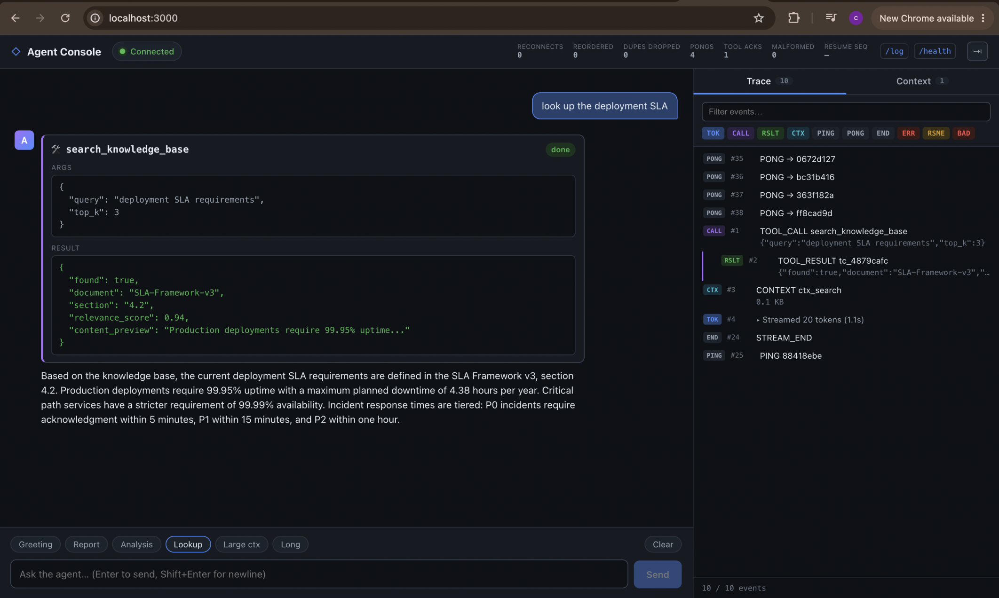
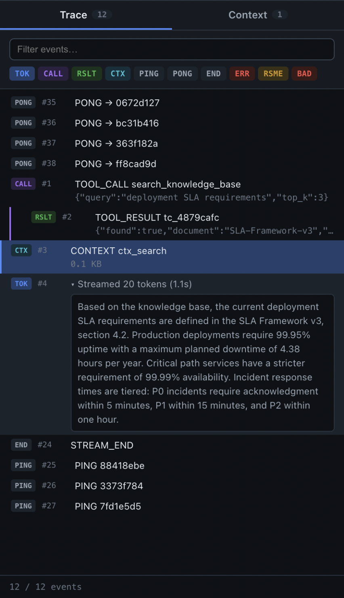
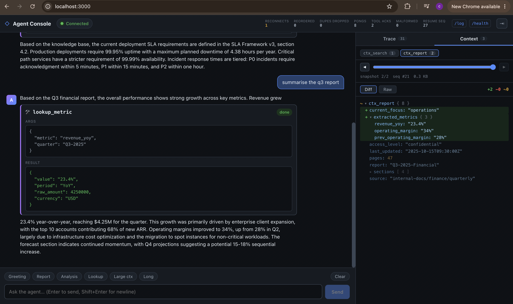

# AI Agent Console

I built this as a real-time chat interface for an AI agent whose backend is
designed to misbehave. It drops connections mid-stream, reorders messages,
sends duplicates, and races its own internal timers. The client is split into
four layers (transport, ordering, state, view) so the network logic to
keeping messages in order and reconnecting cleanly stays small, pure, and
testable which is completely separate from anything React-related. A hand-written
reducer and a small finite state machine track connection and session state
directly.

## Tech stack

- Next.js + TypeScript, strict mode, no `any` anywhere
- CSS Modules for styling
- Vitest for unit tests
- A plain native WebSocket, no real-time framework

## Running it

You'll need the agent server running somewhere, plus this console pointed at it.

```bash
# agent server, in its own terminal
npm install
npm run dev            # ws://localhost:4747 by default

# this console
git clone https://github.com/shryds/ai-agent-console.git
cd ai-agent-console
npm install
cp .env.example .env.local   # NEXT_PUBLIC_AGENT_WS_URL, defaults to ws://localhost:4747/ws
npm run dev                  # http://localhost:3000
```

Open the console, send a message, and the trace timeline and context
inspector fill in as the response streams back.

## What it does

- Streams the agent's response token by token
- Handles a tool call interrupting a response mid-stream without any flicker or the existing text jumping around
- Shows a trace timeline of every message that crossed the socket — filterable, searchable, and linked back to the chat
- Diffs each new context snapshot against the last one, with a history scrubber
- Reconnects on its own after a drop and picks up exactly where it left off

## How it's built

```
VIEW        chat / trace timeline / context inspector — plain rendering
STATE       reducer — pure fold from ordered messages into UI state
ORDERING    reorder buffer — sequencing + deduplication
TRANSPORT   the socket itself + a connection state machine
```

An inbound message moves straight down that list before anything renders —
checked against the ordering buffer first, folded into state only once it's
confirmed to be next in line, then React re-renders whatever actually
changed. The one thing that skips the line is a heartbeat reply, which gets
answered immediately since it's on a tight deadline.

## Tests

```bash
npm test
```

Around 40 tests, mostly on the reorder buffer, the reducer, the connection
state machine, and the diff engine.

## Project layout

```
src/
  connection/     # the socket, heartbeat/backoff, the connection state machine
  protocol/       # the reorder buffer, message parsing, the diff engine
  session/        # the reducer, plus the hook wiring everything together
  components/     # chat, trace timeline, context inspector
```

## Connection and session state

The socket's connection status and a single turn's streaming status are
tracked as two separate state machines, since they change for different
reasons and can be in different states at the same time — the socket can be
sitting `open` while a turn is still waiting on a tool result, and a
reconnect can happen mid-turn without disturbing whatever was already on
screen.

**Connection lifecycle:**

```
                     connect
          idle ────────────────▶ connecting
                                    │
              no resume  │             resume
                   ┌──────────────┘        └───────────┐
                   ▼                                     ▼
                  open ◀────resume complete───────── resuming
                   │  ▲                                   │
   drop / close    │  │ retry (backoff)                   │ drop / close
                   ▼  │                                   │
               reconnecting ◀───────────────────────────┘
                   │
                   │ closed intentionally, from any state
                   ▼
                 closed
```

Backoff doubles each retry — 500ms, 1s, 2s, 4s, 8s, capping at 10s — and
resets the moment a connection opens cleanly. A reconnect always passes
through `resuming` (resume request sent, waiting on the replay) before it's
allowed back to `open`.

**What a single turn goes through:**

```
streaming text ──tool call──▶ frozen text + tool card (pending)
      ▲                                        │
      │                                  tool result arrives
      │                                        ▼
new streaming text ◀──tokens resume──── tool card (done)
                                    … turn completes
```

## Screenshots

- A normal turn where the response streams in and includes a tool call
  <br>

- The trace timeline for that same turn <br>
   <br>

- The context inspector with a snapshot expanded and its diff against the previous one
  <br>

More on the reasoning behind specific choices — the ordering/dedup structure,
how the layout-shift prevention actually works, how reconnection recovers
state, and what would change at a much bigger scale — is in
[`DECISIONS.md`](./DECISIONS.md).
